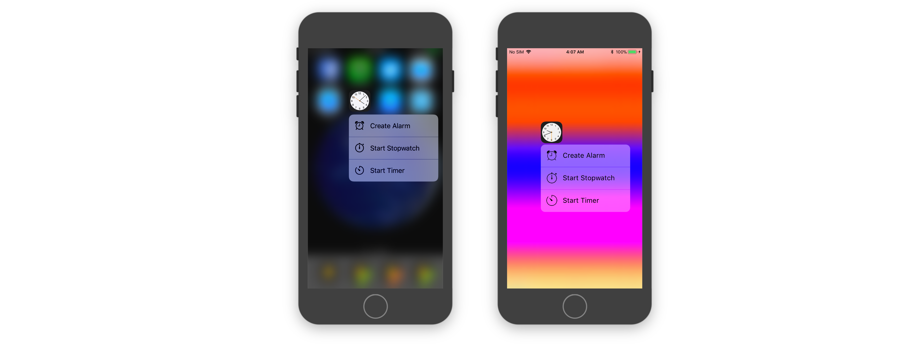
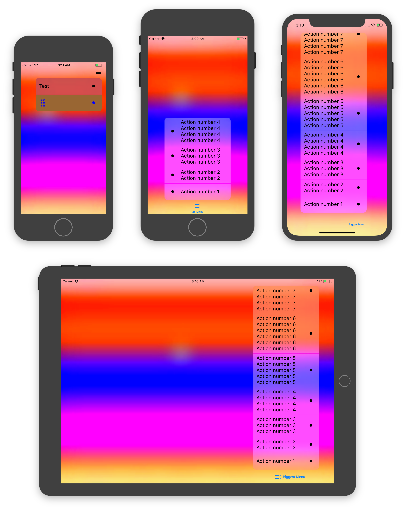

[]()
[](http://cocoapods.org/pods/ActionsList)
[](https://github.com/Carthage/Carthage)
[](http://cocoapods.org/pods/ActionsList)
[](http://cocoapods.org/pods/ActionsList)

ActionsList is an iOS framework for presenting actions lists similar to Apple's Quick Actions menu. It presents and dismisses list with actions with animation from the source view.

It is the best replace for the Android's floating action button in iOS if your app is following the iOS Design Guidelines.



## Requirements

* Xcode 9.0 or later
* iOS 9.0 or later
* Swift 4.0

## Features

* System-like look and feel:

>	- actions order is reverted if list is displayed in top part of the screen;
>	- feedback is generated on list opening and action highlight (if device supports any feedback; can be disabled);
>	- blurred list background and background view (if device supports blur and "Reduce transparency" is off, otherwise dimmed view will be used; can be customized);
>	- source view pulses on list opening;

* Safe Areas supported;
* Universal (iPhone & iPad);
* Change orientation supported (not fully, see [**Known Issues**](#known-issues));
* Highly customizable:

>	- no actions count limits (contained in scroll view);
>	- list background color, action's appearance and background view can be changed;

## Known Issues

* List created with `UITabBarItem` extension method does not support orientation changes:

> Constraints to `UITabBarItem` do not work properly, so after orientation change `sourceView` and `senderView` will have different frames and content positions.

* `UIBarButtonItem`'s create list method is obsoleted since iOS 11:

> In iOS 11 `UIBarButtonItem` created with `image` or `title` initializer has wrong content frame, so `sourceView` will be a bit offset. Instead, use `init(customView:)` to create `UIBarButtonItem` with UIButton and create list with this button. In iOS 10 or earlier issue is not present.

## Installation

StatusAlert is available via CocoaPods and Carthage.

### CocoaPods

To install StatusAlert using [CocoaPods](http://cocoapods.org), add the following line to your `Podfile`:

```ruby
pod 'ActionsList', '~> 0.9.1'
```

### Carthage

To install StatusAlert using [Carthage](https://github.com/Carthage/Carthage), add the following line to your `Cartfile`:

```ruby
github "LowKostKustomz/ActionsList" ~> 0.9.1
```

## Demo

Demo application is included in the `ActionsList` workspace. To run it clone the repo.



## Usage

```swift
// Importing framework
import ActionsList

// Save list model to a property or it will be deallocated and you will have no ability to control it outside of the scope list was created in
private var list: ActionsListModel? = nil

// Creating list in your method
private func method() {

	// For UIButton instance (must be in the view hierarchy)
	let list = uiButton.createActionsList() // Use createActionsList(withDelegate:) if needed
	
	// For UITabBarItem instance (must be in the view hierarchy)
	let list = uiTabBarItem.createActionsList() // Use createActionsList(withDelegate:) if needed
	
	// For UIBarButtonItem instance (must be in the view hierarchy)
	let list = uiBarButtonItem.createActionsList() // Use createActionsList(withColor:font:delegate:) if needed
	
	// For your custom view (must be in the view hierarchy)
	let list = ActionsListModel(senderView: viewThatEmittedListShowing, 
	sourceView: copyOfSenderViewToShowAboveBackgroundView, 
	delegate: actionsListDelegate)
	
	// Add actions to list in order to 
	list.add(action: ActionsListDefaultButtonModel(localizedTitle: "Create Alarm",
	                                               image: UIImage(named: "Alarm clock"),
	                                               action: { action in
		                                                // You can use action's list property to control it
		                                               
		                                                // - To dismiss
		                                                action.list?.dismiss()
		                                                
		                                                // - To update action appearance
		                                                action.appearance.//anything
		                                                //     Do not forget to reload actions to apply changes
		                                                action.list?.reloadActions()
	}))
	
	// Present list
	list.present()
	
	// Do not forget to save list to the property
	self.list = list
}
```

## Customization

> **IMPORTANT**
> > To save system look and feel:
> > 
> > - do not change any of the appearance properties or another settings;
> > - do not add more than 4 actions to the list;
> > - do not disable feedback;

##### List

To customize list background colors use `ActionsListModel`'s `appearance` property or `ActionsListAppearance.List.common` to set default appearance.

##### Actions

To customize actions you can use `ActionsListDefaultButtonModel`'s `appearance` property or `ActionsListAppearance.Button.common` to set default appearance.

Action can be disabled, you can control it via the `ActionsListDefaultButtonModel`'s `isEnabled` property.

Actions generate feedback on highlight, to manage this see [**Feedback**](#feedback) section.

##### Background View

To set custom background view use `ActionsListBackgroundViewBuilder`'s type property.
> Custom background view should implement `ActionsListBackgroundView` protocol

```swift
ActionsListBackgroundViewBuilder.instance.type = .custom(backgroundView: customBackgroundView)
```

To change default dimmed view dimming color use `ActionsListAppearance.BackgroundView.common.dimmingColor`

##### Feedback

> Taptic engine used on iPhone 6s and iPhone 6s Plus only.
> 
> Haptic feedback used on iPhone 7, iPhone 7 Plus and later.
> 
> Other devices do not produce feedback.

To disable feedback generation use `FeedbackGenerator.instance.isEnabled` property. This property manages list opening and action highlight feedback.

## Apps Using _ActionsList_

[BitxfyAppStoreLink]: https://itunes.apple.com/us/app/bitxfy-bitcoin-wallet/id1326910438?ls=1&mt=8

# [ Bitxfy][BitxfyAppstoreLink]

[][BitxfyAppstoreLink]

------

> Feel free to submit pull request if you are using this framework in your apps.

## Author


[](https://twitter.com/LowKostKustomz)
[](mierosh@gmail.com)

### All projects

[ActionsListLink]: https://github.com/LowKostKustomz/ActionsList

#### [ActionsList][ActionsListLink]

[][ActionsListLink]

------

[StatusAlertLink]: https://github.com/LowKostKustomz/StatusAlert

#### [StatusAlert][StatusAlertLink]

[][StatusAlertLink]

## License

> StatusAlert is available under the MIT license. See the [LICENSE](https://github.com/LowKostKustomz/ActionsList/blob/master/LICENSE) file for more info.
